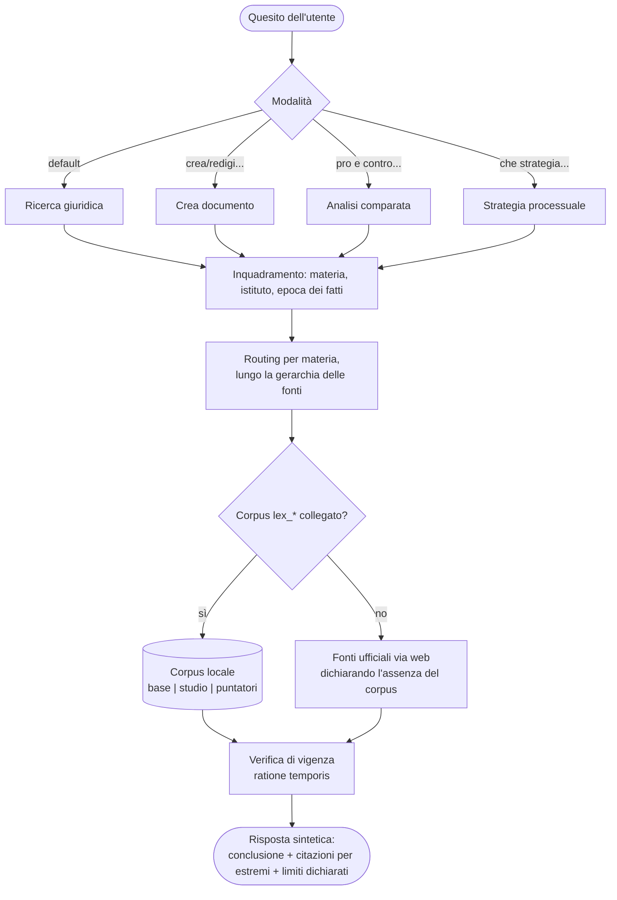

# ricerca-giuridica-it

Skill per Claude (formato Agent Skills) per la ricerca giuridica su fonti italiane e UE: normativa, prassi amministrativa e giurisprudenza. Codifica un metodo di lavoro, non un parere: routing verso le fonti ufficiali, citazioni con estremi verificabili, verifica di vigenza anche ratione temporis, minimizzazione delle query per contesti coperti da segreto professionale, output sintetico per default.

Il formato Agent Skills è uno standard aperto: la skill nasce per Claude (claude.ai, Desktop, Cowork, Claude Code) ed è riutilizzabile negli strumenti che adottano lo stesso formato.

## Come funziona



Le query verso corpus e web contengono solo concetti giuridici astratti: i dettagli del caso non escono mai dalla conversazione. La ricerca e l'esposizione seguono la **gerarchia delle fonti** — Costituzione e leggi costituzionali, diritto UE, fonti primarie statali e regionali e trattati, fonti secondarie, usi — con i criteri di risoluzione delle antinomie dichiarati (gerarchico, di competenza, cronologico, di specialità).

## Le quattro modalità

- **Ricerca giuridica** (default): quesito → risposta fondata su fonti citate per estremi, conclusione in apertura.
- **Crea documento**: bozze di atti, pareri e clausole con citazioni ancorate e segnaposto espliciti `[DA COMPLETARE: ...]` per i dati mancanti.
- **Analisi comparata**: data una tesi, precedenti a favore e contro su due elenchi distinti, senza cherry-picking; orientamento prevalente dichiarato solo se emerge dal materiale recuperato.
- **Strategia processuale**: dato un caso, opzioni a confronto (fondamento, forza, debolezza, rischi), raccomandazione motivata e passi operativi. Orientamento, non parere.

L'output è sintetico per default; `in breve` lo comprime, `approfondisci` lo espande. Esempi d'uso per ogni modalità in [GUIDA.md](GUIDA.md).

## Fonti pubbliche utilizzate

Solo fonti ufficiali o liberamente accessibili — mai banche dati commerciali:

- **Normativa:** Normattiva (testo multivigente, API CC BY 4.0), sezione Legislazione regionale di Normattiva (motore federato sulle banche dati dei Consigli regionali), EUR-Lex/CELLAR, ATRIO (trattati internazionali, MAECI), Gazzetta Ufficiale, raccolte provinciali degli usi delle Camere di commercio, lavori preparatori su camera.it e senato.it.
- **Giurisprudenza:** SentenzeWeb (Cassazione civile e penale), Banca Dati di Merito (civile, via SPID), giustizia-amministrativa.it e open data OpenGA (CC BY 4.0), Corte costituzionale (pronunce e massime ufficiali), Corte dei conti, InfoCuria (CGUE), HUDOC (CEDU), UPC.
- **Massime e orientamenti:** massimario ufficiale della Consulta, rassegne e relazioni dell'Ufficio del Massimario della Cassazione, Portale del Massimario IPZS, sommari CGUE.
- **Prassi e autorità:** Agenzia delle Entrate e def.finanze (tributario), ANAC (appalti), INL, interpelli del Ministero del Lavoro e INPS (lavoro e previdenza), Garante privacy ed EDPB, Banca d'Italia, IVASS, CONSOB e UIF (vigilanza), AGCM (concorrenza e consumatori), MIM (scuola), Ministero dell'Interno ed EUAA (immigrazione), EBA/ESMA/EIOPA (finanza UE).
- **ADR e contratti collettivi:** decisioni ABF e ACF, elenchi degli organismi ADR (MIMIT e Commissione UE), archivio CCNL del CNEL (open data IODL 2.0), ARAN.

Endpoint, licenze e condizioni di riuso complete nei cataloghi `references/` della skill; il kit minimo per ciascuna delle 22 materie coperte è in `fonti_per_materia.md`.

## Corpus documentale opzionale

Se la conversazione espone tool MCP con prefisso `lex_`, la skill interroga un corpus documentale locale organizzato in tre collezioni: **`base`** (fonti aperte indicizzate), **`studio`** (documenti propri dell'utente, citati come fonte dello studio e mai confusi con le fonti ufficiali), **`puntatori`** (indici di fonti a riuso ristretto: solo metadati e URL, il testo si legge sull'originale). La copertura viene sempre dichiarata (`lex_stato_corpus`); senza corpus la skill lavora sulle sole fonti ufficiali via web, dichiarandolo.

## Installazione

**claude.ai / Claude Desktop / app mobile** (per account, richiede l'esecuzione codice attiva — cerca "esecuzione codice" o "code execution" nelle impostazioni della tua versione, il percorso esatto del menu cambia tra le superfici):
scarica lo ZIP dall'[ultima release](https://github.com/belicinodev/ricerca-giuridica-it/releases/latest) e caricalo da Personalizza > Skill. Fatto questo sei pronto: scrivi la domanda in chat, nessun comando da digitare, la skill si attiva da sola sulle frasi giuste (v. [GUIDA.md](GUIDA.md)).

**Claude Code** (via più tecnica: richiede git e un terminale — se non li conosci, usa il metodo ZIP sopra: la skill è identica), per il singolo progetto: clona questo repo e apri la cartella, la skill in `.claude/skills/` viene scoperta automaticamente. Per tutti i progetti: `cp -R .claude/skills/ricerca-giuridica-it ~/.claude/skills/`.

## Struttura

```
.claude/skills/ricerca-giuridica-it/
  SKILL.md          metodo, regole, modalità, flusso di lavoro
  references/       cataloghi delle fonti, caricati a richiesta
    fonti_per_materia.md       kit minimo per 22 materie
    fonti_dati_giuridici.md    endpoint, licenze, massime, ADR/CCNL
    fonti_normative.md         estremi di codici, leggi e testi unici
    computo_termini.md         regole di computo dei termini (metodo, non aritmetica)
    percorsi_processuali.md    cancelli e riti per tipo di controversia (procedibilità, decadenze, ADR)
GUIDA.md            miniguida d'uso delle modalità
CONTRIBUTING.md     meccanica di contribuzione (eval, comandi pre-PR)
evals/evals.json    domande di regressione con risposte attese verificate
schema/              contratto pubblico dei tool lex_* (JSON Schema)
scripts/            build dello ZIP, verifiche statiche, esecuzione eval
.github/workflows/  release dello ZIP a ogni tag v*; controlli di qualità a ogni push/PR
```

## Limiti, dichiarati

- Non è consulenza legale e non la sostituisce. L'output va verificato sulla fonte ufficiale prima di qualunque uso con effetti (atti, gare, rapporti con la PA).
- La skill è metodologia: senza un corpus collegato non aggiunge conoscenza, aggiunge disciplina. Gli estremi normativi contenuti nei cataloghi hanno una data e invecchiano: fanno fede Normattiva ed EUR-Lex.
- Non esiste verifica automatica che un precedente sia ancora attuale (nessun citator gratuito); le massime CED con numero Rv non sono liberamente accessibili; la giurisprudenza di merito penale e quella di famiglia/minori non hanno fonti gratuite strutturate. La skill dichiara questi limiti invece di aggirarli.

## Contribuire

Issue e proposte sono benvenute, con una regola: ogni nuova regola di comportamento entra solo accompagnata da almeno una eval che la verifica, e le risposte attese si scrivono solo dopo verifica manuale sulla fonte ufficiale. Le eval esistenti sono in `evals/evals.json`. Meccanica e comandi in [CONTRIBUTING.md](CONTRIBUTING.md).

## Versioni

Storia in `CHANGELOG.md`. A ogni tag `v*` il workflow pubblica lo ZIP installabile tra gli asset della release.

## Licenza

MIT. Vedi `LICENSE`.
